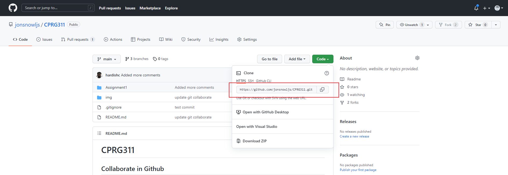

# CPRG311

## Collaborating process for Assignment 1

### Copy [this](https://github.com/jonsnowljs/CPRG311) git repo link

 

### import the repo to Eclipse

  
  
  

### Make some changes in the code

### Commit you changes
  
### Push your changes to Github

### Fetch others new changes 

--- 
## Collaborate process for assignment 2

### Fork the repo

- Fork [this](https://github.com/jonsnowljs/CPRG311) repo into your Github
  

### Clone your forked repo to Eclipse

- Copy the repo link in your repo (not in my repo)

- import your repo to your Eclipse
  
  
  

### Create a new branch and switch to 
- 