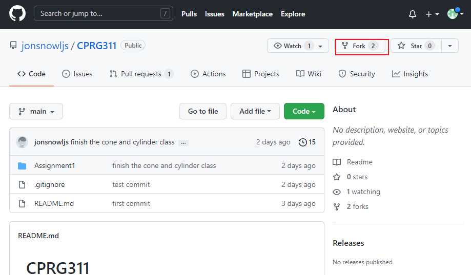
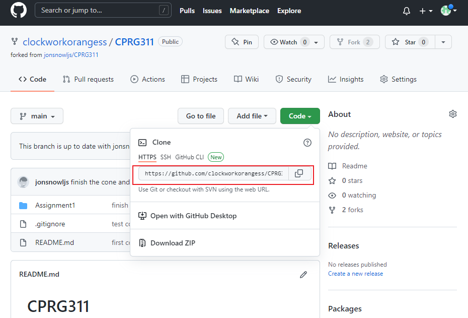
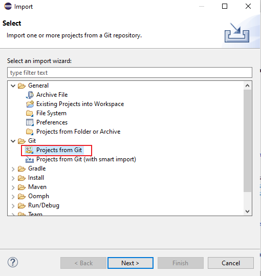
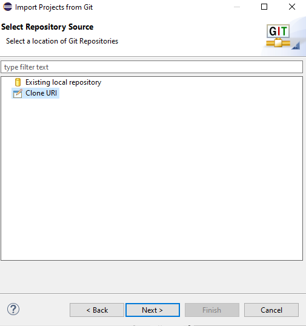
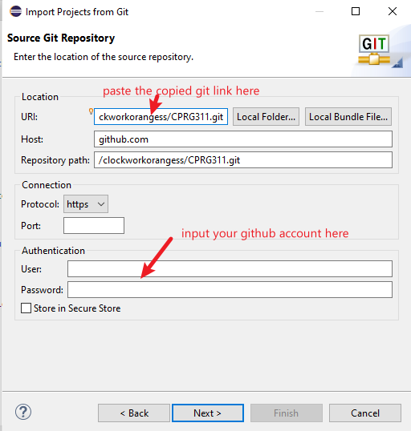

# CPRG311

## Collaborate in Github

### Fork the repo

- Fork [this](https://github.com/jonsnowljs/CPRG311) repo into your Github
  

### Clone your forked repo to Eclipse

- Copy the repo link in your repo (not in my repo)

- import your repo to your Eclipse
  
  
  

### Create a new branch and 